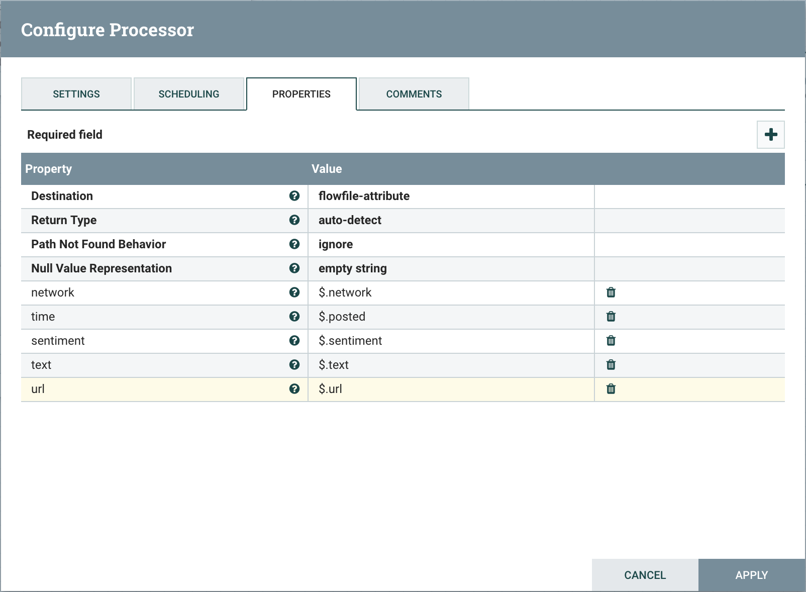
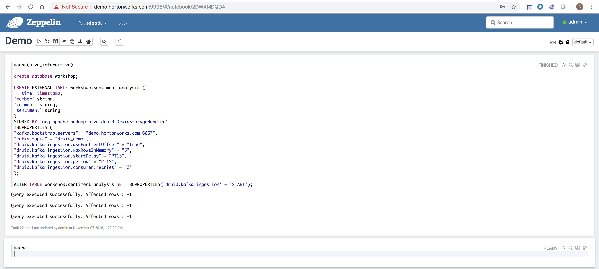

# HDP & HDF Labs: Real-time social media sentiment analysis with NiFi, Kafka, Druid, Zeppelin and Superset

## Prerequisite

- Launch AWS AMI **ami-03302dad17fa68071** with **m5d.4xlarge** instance type
- Keep default storage (300GB SSD)
- Set security group with:
  - Type: All TCP
  - Source: My IP
- Choose an existing or create a new key pair

## Content

* [Lab 1 - Accessing the sandbox](#accessing-the-sandbox)
* [Lab 2 - Stream data using NiFi](#stream-data-using-nifi)
* [Lab 3 - Explore Kafka](#explore-kafka)
* [Lab 4 - Explore Hive, Druid and Zeppelin](#explore-hive-druid-and-zeppelin)
* [Lab 5 - Stream data into Hive using NiFi](#stream-data-into-hive-using-nifi)
* [Lab 6 - Create live dashboard with Superset](#create-live-dashboard-with-superset)

## Accessing the sandbox

### Add an alias to your hosts file

On Mac OS X, open a terminal and vi /etc/hosts

On Windows, open C:\Windows\System32\drivers\etc\hosts

Add a new line to the existing

```nn.nnn.nnn.nnn	demo.hortonworks.com```

Replacing the ip (nn.nnn.nnn.nnn) address with the one provided

### Start all HDP and HDF services

Open a web browser and go to the following url

```http://demo.hortonworks.com:8080/```

Log in with the following credential

Username: admin
Password: admin

If services are not started, start all services


It can take up to 18 minutes...


### SSH to the sandbox

Copy and paste the content of [ppk](keys/hdp-workshop.ppk) for Windows or [pem](keys/hdp-workshop.pem) for Mac OS X

On Mac use the terminal to SSH

For Mac users, don't forget to ```chmod 400 /path/to/hdp-workshop.pem``` before ssh'ing


On Windows use [putty](https://www.chiark.greenend.org.uk/~sgtatham/putty/latest.html)


## Stream data using NiFi

Open [NiFi](http://demo.hortonworks.com:9090/nifi/) UI

### Get social media sentiment analysis: let's see what people think about Hortonworks :)

For the purpose of this exercise we are going to use the [Social Searcher](https://www.social-searcher.com/) monitoring tool.

The API documentation can be found [here](https://www.social-searcher.com/api-v2/)

To get started we need to get the data from the Social Media REST API, extract what we need and save it to a file

We want to have a feeling of the sentiment when people are posting about Hortonworks on Facebook and Twitter

### Build NiFi flow

- Step 1: Add a InvokeHTTP processor to the canvas
  - Double click on the processor
  - On settings tab, check all relationships except **Response**
  - On scheduling tab, set Run Schedule to 30 sec
  - Go to properties tab and add the **Remote URL** value: ```https://api.social-searcher.com/v2/search?q=Hortonworks&network=facebook,twitter&limit=20```
  - Apply changes
  
- Step 2: Add a SplitJson connector to the canvas and link from InvokeHttp on **Response** relationship
  - Double click on the processor
  - On settings tab, check both **failure** and **original** relationships
  - On properties tab give **JsonPath Expression** the value: **$.posts**
  - Apply changes
  
- Step 3: Add EvaluateJsonPath to the canvas and link from SplitJson on **split** relationship
  - Double click on the processor
  - On settings tab, check both **failure** and **unmatched** relationships
  - On properties tab
  - Change **Destination** value to **flowfile-attribute**
  - Add properties as follow
    - network: $.network
    - time: $.posted
    - sentiment: $.sentiment
    - text: $.text
    - url: $.url
    
    

- Step 4: Add a AttributeToJSON connector to the canvas and link from EvaluateJsonPath on **matched** relationship
  - Double click on the processor
  - On settings tab, check **failure** relationship
  - Change **Destination** value to **flowfile-content**
  - Change **Attribute List** value to **network,time,sentiment,text,url**
  - Apply changes
  
- Step 5: Add a MergeContent connector to the canvas and link from AttributeToJSON on **success** relationship
  - Double click on the processor
  - On settings tab, check both **failure** and **original** relationships
  - Apply changes
  
- Step 6: Add a PutFile connector to the canvas and link from MergeContent on **merge** relationship
  - Double click on the processor
  - On settings tab, check all relationships
  - Change **Directory** value to **/tmp/socialmedia**
  - Change **Conflict Resolution Strategy** value to **replace**
  - Apply changes
  
- Step 7: Start the entire flow


Explore the file created under /tmp/socialmedia

## Explore Kafka

ssh to the AWS instance as explained above then become root

```sudo su -```

Navigate to Kafka

```cd /usr/hdp/current/kafka-broker```

Create a topic named druid_demo

```./bin/kafka-topics.sh --create --zookeeper demo.hortonworks.com:2181 --replication-factor 1 --partitions 1 --topic druid_demo```

List topics to check that it's been created

```./bin/kafka-topics.sh --list --zookeeper demo.hortonworks.com:2181```

Open a consumer so later we can monitor and verify that JSON records will stream through this topic

```./bin/kafka-console-consumer.sh --bootstrap-server demo.hortonworks.com:6667 --topic druid_demo```

Keep the terminal open

## Explore Hive, Druid and Zeppelin

Visit [Zeppelin](http://demo.hortonworks.com:9995/)
And log in as admin (password: admin)

Create a new notebook called Demo (use jdbc as default interpreter)

Add the interpreter to connect to Hive LLAP

```%jdbc(hive_interactive)```

Create a database named workshop and run the SQL

```SQL
create database workshop;
```

Create the Hive table backed by Druid storage where the social medias sentiment analysis will be streamed into

```SQL
CREATE EXTERNAL TABLE workshop.sentiment_analysis (
`__time` timestamp,
`network` string,
`sentiment` string
)
STORED BY 'org.apache.hadoop.hive.druid.DruidStorageHandler'
TBLPROPERTIES (
"kafka.bootstrap.servers" = "demo.hortonworks.com:6667",
"kafka.topic" = "druid_demo",
"druid.kafka.ingestion.useEarliestOffset" = "true",
"druid.kafka.ingestion.maxRowsInMemory" = "5",
"druid.kafka.ingestion.startDelay" = "PT1S",
"druid.kafka.ingestion.period" = "PT1S",
"druid.kafka.ingestion.consumer.retries" = "2"
);
```

Start Druid indexing

```SQL
ALTER TABLE workshop.sentiment_analysis SET TBLPROPERTIES('druid.kafka.ingestion' = 'START');
```

Verify that supervisor and indexing task are running from the [Druid overload console](http://demo.hortonworks.com:8090/console.html)



## Stream data into Hive using NiFi

First we are going to stop and disable some processors from the previous Flow

- Step 1: Disable unnecessary processors
  - Right click and disable MergeContent and PutFile processors
  
- Step 2: Format post time to comply with [ISO format](https://en.wikipedia.org/wiki/ISO_8601) (Druid requirement)
  - Add UpdateAttribute processor between EvaluateJSonPath and AttributesToJSON processors
  - Using handy [NiFi's language expression](https://nifi.apache.org/docs/nifi-docs/html/expression-language-guide.html#dates), add a new attribue ```__time``` with value: ```${time:toDate("yyyy-MM-dd HH:mm:ss '+00000'", "GMT"):format("yyyy-MM-dd'T'HH:mm:ss'Z'", "Asia/Singapore")}```

- Step 3: Modify existing AttributesToJSON processor to stream new attribute ```__time```
  - Double click on processor
  - On settings tab, check **failure** relationship
  -  Go to properties tab
  - Replace ```network,time,sentiment,text,url``` in the Attributes List with ```network,__time,sentiment```
  - Apply changes
  
- Step 4: Add a **PublishKafkaRecord_1_0** connector to the canvas and link from AttributesToJSON on **success** relationship
  - Double click on the processor
  - On settings tab, check all relationships
  - On properties tab
  - Change **Kafka Brokers** value to **demo.hortonworks.com:6667**
  - Change **Topic Name** value to **druid_demo**
  - Change **Use Transactions** value to **false**
  - Apply changes
  
- Step 5: Start the entire flow
	
The overall flow should look like this


You should be able to see records streaming through Kafka looking at the terminal with Kafka consumer opened earlier


Going back to Zeppelin, we can query the data streamed in real-time


## Create live dashboard with Superset

Go to [Superset UI](http://demo.hortonworks.com:9088/)

Log in with user **admin** and password **superset**

Refresh Druid metadata


Edit the datasource record and verify that the columns are listed, same for the metric (you might need to scroll down)


Click on the datasource and create the following dashboard


Play with other visualization types


