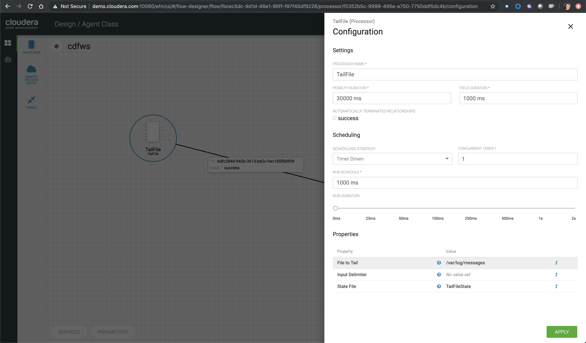

# HDP & HDF Labs: Real-time sentiment analysis with NiFi, Kafka, Druid, Zeppelin and Superset


## Prerequisite

**Although this AMI is not public and is available for Cloudera workhops only, the steps can be reproduced in your own environment**

- Launch AWS AMI **ami-08820f3fb1e5a37a4** with **m5d.4xlarge** instance type
- Keep default storage (300GB SSD)
- Set security group with:
  - Type: All TCP
  - Source: My IP
- Choose an existing or create a new key pair

## Content

* [Lab 1 - Accessing the sandbox](#accessing-the-sandbox)
* [Lab 2 - Stream data using NiFi](#stream-data-using-nifi)
* [Lab 3 - Explore Kafka](#explore-kafka)
* [Lab 4 - Explore Hive, Druid and Zeppelin](#explore-hive-druid-and-zeppelin)
* [Lab 5 - Stream enhanced data into Hive using NiFi](#stream-enhanced-data-into-hive-using-nifi)
* [Lab 6 - Create live dashboard with Superset](#create-live-dashboard-with-superset)
* [Lab 7 - Collect syslog data using MiNiFi and EFM](#collect-syslog-data-using-minifi-and-efm)

## Accessing the sandbox

### Add an alias to your hosts file

On Mac OS X, open a terminal and vi /etc/hosts

On Windows, open C:\Windows\System32\drivers\etc\hosts

Add a new line to the existing

```nn.nnn.nnn.nnn	demo.cloudera.com```

Replacing the ip (nn.nnn.nnn.nnn) address with the one provided

### Start all HDP and HDF services

Open a web browser and go to the following url

```http://demo.cloudera.com:8080/```

Log in with the following credential

Username: admin
Password: admin

If services are not started, start all services


It can take up to 18 minutes...


### SSH to the sandbox

Copy and paste the content of [ppk](keys/hdp-workshop.ppk) for Windows or [pem](keys/hdp-workshop.pem) for Mac OS X

On Mac use the terminal to SSH

For Mac users, don't forget to ```chmod 400 /path/to/hdp-workshop.pem``` before ssh'ing


On Windows use [putty](https://www.chiark.greenend.org.uk/~sgtatham/putty/latest.html)


## Stream data using NiFi

### Run the sentiment analysis model as a REST-like service

For the purpose of this exercise we are not going to train, test and implement a classification model but re-use an existing sentiment analysis model, provided by the Stanford University as part of their [CoreNLP - Natural language software](https://stanfordnlp.github.io/CoreNLP/)

First, after ssh'ing to the sandbox, download and unzip the CoreNLP using the wget as below:

```bash
wget http://nlp.stanford.edu/software/stanford-corenlp-full-2018-10-05.zip
unzip stanford-corenlp-full-2018-10-05.zip
```

Then, in order to start the [web service](https://stanfordnlp.github.io/CoreNLP/corenlp-server.html), run the [CoreNLP jar file](https://stanfordnlp.github.io/CoreNLP/download.html), with the following commands:

```bash
cd /path/to/stanford-corenlp-full-2018-10-05
java -mx1g -cp "*" edu.stanford.nlp.pipeline.StanfordCoreNLPServer -port 9999 -timeout 15000 </dev/null &>/dev/null &
```

This will run in the background on port 9999 and you can visit the [web page](http://demo.cloudera.com:9999/) to make sure it's running.

If you want to play with it, remove all annotations and use **Sentiment** only


The model will classify the given text into 5 categories:

- very negative
- negative
- neutral
- positive
- very positive

### Build NiFi flow

In order to have a streaming source available for our workshop, we are going to make use of the publicly available Meetup's API and connect to their WebSocket.

The API documentation is available [here](https://www.meetup.com/meetup_api/docs/stream/2/event_comments/#websockets): https://www.meetup.com/meetup_api/docs/stream/2/event_comments/#websockets

In this scenario we are going to stream all comments, for all topics, into NiFi and classify each one of them into the 5 categories listed above. 

To do that we need to score each comment's content against the Stanford CoreNLP's sentiment model. 

In real-world use case we would probably filter by event of our interest but for the sake of this workshop we won't and assume all comments are given for the same event: the famous HDF workshop!

Let's get started... Open [NiFi UI](http://demo.cloudera.com:9090/nifi/) and follow the steps below:

- Step 1: Add a ConnectWebSocket processor to the canvas
  - Double click on the processor
  - On settings tab, check all relationships except **text message**
  - Got to properties tab and select or create **JettyWebSocketClient** as the WebSocket Client ControllerService
  - Then configure the service (click on the arrow on the right)	
  	- Go to properties tab and add this value: ```ws://stream.meetup.com/2/event_comments``` to property **WebSocket URI**
  	- Apply the change
  	- Enable the controller service (click on the thunder icon) and close the window
  - Go to properties tab and give a value to **WebSocket Client Id** such as **demo** for example
  - Apply changes
  
- Step 2: Add an UpdateAttribute connector to the canvas and link from ConnectWebSocket on **text message** relationship
  - Double click on the processor
  - On properties tab add new property **mime.type** clicking on + icon and give the value **application/json**. This will tell the next processor that the messages sent by the Meetup WebSocket is in JSON format.
  - Add another property **event** to set an event name **HDF workshop** for the purpose of this exercise as explained before
  - Apply changes
  
  
  
- Step 3: Add EvaluateJsonPath to the canvas and link from UpdateAttribute on **success** relationship
  - Double click on the processor
  - On settings tab, check both **failure** and **unmatched** relationships
  - On properties tab, change **Destination** value to **flowfile-attribute**
  - And add properties as follow
    - comment: $.comment
    - member: $.member.member_name
    - timestamp: $.mtime
    
    
    
    The messages coming out of the web sockets look like this:
    
    ```json
    {"visibility":"public","member":{"member_id":11643711,"photo":"https:\/\/secure.meetupstatic.com\/photos\/member\/3\/1\/6\/8\/thumb_273072648.jpeg","member_name":"Loka Murphy"},"comment":"I didn’t when I registered but now thinking I want to try and get one since it’s only taking place once.","id":-259414201,"mtime":1541557753087,"event":{"event_name":"Tunnel to Viaduct 8k Run","event_id":"256109695"},"table_name":"event_comment","group":{"join_mode":"open","country":"us","city":"Seattle","name":"Seattle Green Lake Running Group","group_lon":-122.34,"id":1608555,"state":"WA","urlname":"Seattle-Greenlake-Running-Group","category":{"name":"fitness","id":9,"shortname":"fitness"},"group_photo":{"highres_link":"https:\/\/secure.meetupstatic.com\/photos\/event\/9\/e\/f\/4\/highres_465640692.jpeg","photo_link":"https:\/\/secure.meetupstatic.com\/photos\/event\/9\/e\/f\/4\/600_465640692.jpeg","photo_id":465640692,"thumb_link":"https:\/\/secure.meetupstatic.com\/photos\/event\/9\/e\/f\/4\/thumb_465640692.jpeg"},"group_lat":47.61},"in_reply_to":496130460,"status":"active"}
    ```

- Step 4: Add an AttributesToCSV connector to the canvas and link from EvaluateJsonPath on **matched** relationship
  - Double click on the processor
  - On settings tab, check **failure** relationship
  - Change **Destination** value to **flowfile-content**
  - Change **Attribute List** value to write only the above parsed attributes: **timestamp, event, member, comment**
  - Apply changes
  
- Step 5: Add a PutFile connector to the canvas and link from AttributesToCSV on **success** relationship
  - Double click on the processor
  - On settings tab, check all relationships
  - Change **Directory** value to **/tmp/workshop**
  - Apply changes
  
- Step 6: Start the entire flow


SSH to the sandbox and explore the files created under /tmp/workshop.

On the NiFi UI, explore the FlowFiles' attributes and content looking at Data provenance.

**Once done, stop the flow and delete all files ```sudo rm -rf /tmp/workshop/*```**

## Explore Kafka

ssh to the AWS instance as explained above then become root

```sudo su -```

Navigate to Kafka

```cd /usr/hdp/current/kafka-broker```

Create a topic named **meetup_comment_ws**

```./bin/kafka-topics.sh --create --zookeeper demo.cloudera.com:2181 --replication-factor 1 --partitions 1 --topic meetup_comment_ws```

List topics to check that it's been created

```./bin/kafka-topics.sh --list --zookeeper demo.cloudera.com:2181```

Open a consumer so later we can monitor and verify that JSON records will stream through this topic:

```./bin/kafka-console-consumer.sh --bootstrap-server demo.cloudera.com:6667 --topic meetup_comment_ws```

Keep this terminal open.

We will now open a new terminal to publish some messages...

Follow the same steps as above except for the last step where we are going to open a producer instead of a consumer:

```./bin/kafka-console-producer.sh --broker-list demo.cloudera.com:6667 --topic meetup_comment_ws```

Type anything and click enter. Then go back to the first terminal with the consumer running. You should see the same message get displayed!

## Explore Hive, Druid and Zeppelin

Visit [Zeppelin](http://demo.cloudera.com:9995/) and log in as admin (password: admin)

Create a new note(book) called Demo (use jdbc as default interpreter)


Add the interpreter to connect to Hive LLAP

```%jdbc(hive_interactive)```

Create a database named workshop and run the SQL

```SQL
CREATE DATABASE workshop;
```

Create the Hive table backed by Druid storage where the social medias sentiment analysis will be streamed into

```SQL
CREATE EXTERNAL TABLE workshop.meetup_comment_sentiment (
`__time` timestamp,
`event` string,
`member` string,
`comment` string,
`sentiment` string
)
STORED BY 'org.apache.hadoop.hive.druid.DruidStorageHandler'
TBLPROPERTIES (
"kafka.bootstrap.servers" = "demo.cloudera.com:6667",
"kafka.topic" = "meetup_comment_ws",
"druid.kafka.ingestion.useEarliestOffset" = "true",
"druid.kafka.ingestion.maxRowsInMemory" = "5",
"druid.kafka.ingestion.startDelay" = "PT1S",
"druid.kafka.ingestion.period" = "PT1S",
"druid.kafka.ingestion.consumer.retries" = "2"
);
```


Start Druid indexing

```SQL
ALTER TABLE workshop.meetup_comment_sentiment SET TBLPROPERTIES('druid.kafka.ingestion' = 'START');
```

Verify that supervisor and indexing task are running from the [Druid overload console](http://demo.cloudera.com:8090/console.html)


## Stream enhanced data into Hive using NiFi

Go back to [NiFi UI](http://demo.cloudera.com:9090/nifi/) and follow the steps below:

- Step 1: Remove no longer needed processor from previous flow
  - Right click on the relationship between EvaluateJsonPath and AttibutesToCSV processors and delete
  - Delete the AttibutesToCSV processor
  - Do the same for the PutFile processor
  
- Step 2: Prepare the content to be posted to the sentiment analysis service
  - Add ReplaceText processor and link from EvaluateJSonPath on **matched** relationship
  - Double click on processor and check **failure** on settings tab
  - Go to properties tab and remove value for **Search Value** and set it to empty string
  - Set **Replacement Value** with value: **${comment:replaceAll('\\.', ';')}**. We want to make sure the entire comment is evaluated as one sentence instead of one evaluation per sentence within the same comment.
  - Set **Replacement Strategy** to **Always Replace**
  - Apply changes
  
- Step 3: Call the web service started earlier on incoming message
  - Add InvokeHTTP processor and link from ReplaceText on **success** relationship
  - Double click on processor and check all relationships except **Response** on settings tab
  - Go to properties tab and set value for **HTTP Method** to **POST**
  - Set **Remote URL** with value: ```http://demo.cloudera.com:9999/?properties=%7B%22annotators%22%3A%22sentiment%22%2C%22outputFormat%22%3A%22json%22%7D``` which is the url encoded value for ```http://demo.cloudera.com:9999/?properties={"annotators":"sentiment","outputFormat":"json"}```
  - Set **Content-Type** to **application/x-www-form-urlencoded**
  - Apply changes
  
- Step 4: Add EvaluateJsonPath to the canvas and link from InvokeHTTP on **Response** relationship
  - Double click on the processor
  - On settings tab, check both **failure** and **unmatched** relationships
  - On properties tab
  - Change **Destination** value to **flowfile-attribute**
  - Add on the property **sentiment** with value **$.sentences[0].sentiment**
  - Apply changes
  
- Step 5: Format post time to comply with [ISO format](https://en.wikipedia.org/wiki/ISO_8601) (Druid requirement)
  - Add UpdateAttribute processor and link from EvaluateJsonPath on **matched** relationship
  - Using handy [NiFi's language expression](https://nifi.apache.org/docs/nifi-docs/html/expression-language-guide.html#dates), add a new attribue ```__time``` with value: ```${timestamp:format("yyyy-MM-dd'T'HH:mm:ss'Z'", "Asia/Singapore")}``` to properties tab

- Step 6: Add AttributesToJSON processor to prepare the message to be published to the Kafka topic created before. Link from UpdateAttribute.
  - Double click on processor
  - On settings tab, check **failure** relationship
  - Go to properties tab
  - In the Attributes List value set ```__time, event, comment, member, sentiment``` to match the previously created Hive table
  - Change Destination to **flowfile-content**
  - Set Include Core Attributes to **false**
  - Apply changes
  
- Step 7: Last step, add a **PublishKafka_2_0** connector to the canvas and link from AttributesToJSON on **success** relationship
  - Double click on the processor
  - On settings tab, check all relationships
  - On properties tab
  - Change **Kafka Brokers** value to **demo.cloudera.com:6667**
  - Change **Topic Name** value to **meetup_comment_ws**
  - Change **Use Transactions** value to **false**
  - Apply changes
  
Before starting the NiFi flow make sure that the [sentiment analysis Web service](https://github.com/charlesb/HDP-HDF-workshop#run-the-sentiment-analysis-model-as-a-rest-like-service) is running
	
The overall flow should look like this


You should be able to see records streaming through Kafka looking at the terminal with Kafka consumer opened earlier


Going back to Zeppelin, we can query the data streamed in real-time


## Create live dashboard with Superset

Go to [Superset UI](http://demo.cloudera.com:9088/)

Log in with user **admin** and password **admin**

Refresh Druid metadata


Edit the **meetup_comment_sentiment** datasource record and verify that the columns are listed, same for the metric (you might need to scroll down)


Click on the datasource and create the following query


From this query, create a dashboard that will refresh automatically


## Collect syslog data using MiNiFi and EFM

Go to NiFi Registry and create a bucket named **demo**

As root (sudo su -) start EFM and MiNiFi

```bash
service efm start
service minifi start
```
Visit [EFM UI](http://demo.cloudera.com:10080/efm/ui/)

You should see heartbeats coming from the agent


Now create a simple flow to collect local syslog messages and forward them to NiFi, where the logs will be parsed, transformed into another format and pushed to a Kafka topic.

Our agent has been tagged with the class 'demo' (check nifi.c2.agent.class property in /usr/minifi/conf/bootstrap.conf) so we are going to create a template under this specific class

But first we need to add an Input Port to the root canvas of NiFi and build a flow as described before. Input Port are used to receive flow files from remote MiNiFi agents or other NiFi instances.


Don't forget to create a new Kafka topic as explained in Lab 3 above.

We are going to use a Grok parser to parse the syslog messages. Here is a Grok expression that can be used to parse such logs format:

```%{SYSLOGTIMESTAMP:syslog_timestamp} %{SYSLOGHOST:syslog_hostname} %{DATA:syslog_program}(?:\[%{POSINT:syslog_pid}\])?: %{GREEDYDATA:syslog_message}```

Now that we have built the NiFi flow that will receive the logs, let's go back to the EFM UI and build the MiNiFi flow as below:


This MiNiFi agent will tail /var/log/messages and send the logs to a remote process group (our NiFi instance) using the Input Port.



Don't forget to increase the scheduler!

Please note that the NiFi instance has been configured to receive data over HTTP only, not RAW


Now we can start the NiFi flow and publish the MiNiFi flow to NiFi registry (Actions > Publish...)

Visit [NiFi Registry UI](http://demo.cloudera.com:61080/nifi-registry/explorer/grid-list) to make sure your flow has been published successfully.


Within few seconds, you should be able to see syslog messages streaming through your NiFi flow and be published to the Kafka topic you have created.


